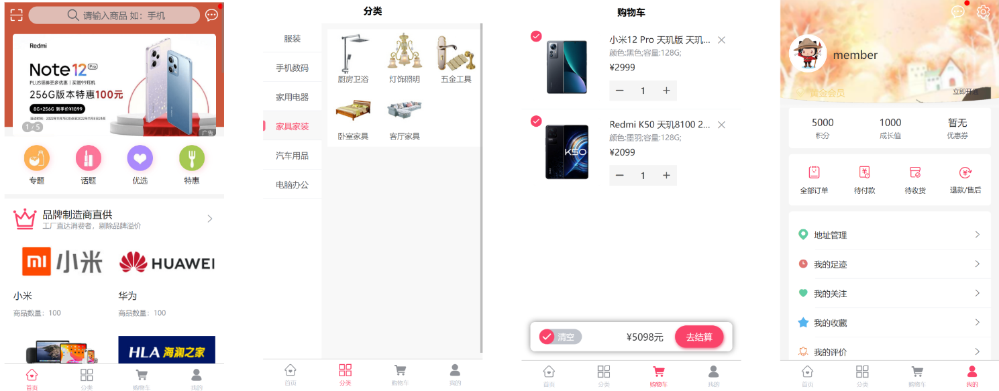
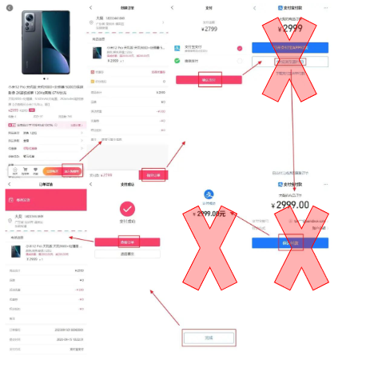

# front-end-BIGGGGG-Work

## 任务目标

使用React制作一套商城系统,需要有以下功能
系统分为两端：产品端以及后台管理端

## 产品端

### 商城主页面

首页 – 搜索框、轮播图、热门商品
分类 – 所有商品的分类索引
购物车
我的页面

### 购买全链路

商品页面
创建订单
支付页面
订单详情页面
购物车创建订单同流程

## 管理端

后台管理

- 权限管理等同第三次作业
- 后台用户登录
- 商品管理
- 分类管理
- 订单管理
- 发货
